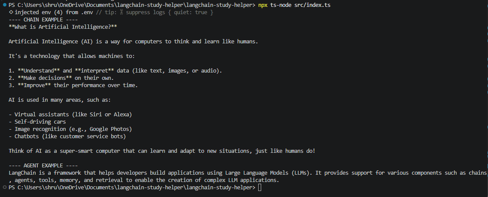
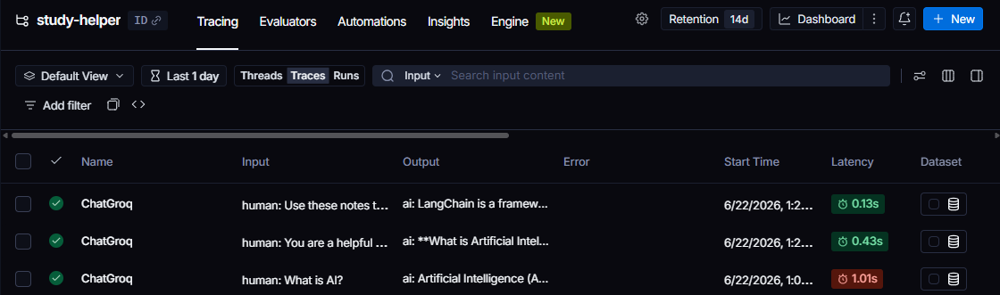

# LangChain Study Helper AI App

## Project Overview

This project demonstrates the fundamentals of building an AI application using **TypeScript** and **LangChain**. The application is a **Study Helper AI Assistant** that answers user questions, uses chains for prompt execution, agents for decision-making, tools for note retrieval, and LangSmith for tracing and debugging.

---

# What Problem Does LangChain Solve?

Building AI applications directly using LLM APIs can be difficult because developers need to manually manage:

* Prompt templates
* Memory
* Context handling
* Tool calling
* Agent workflows
* Retrieval pipelines

LangChain simplifies AI application development by providing reusable components such as chains, agents, tools, memory, and retrieval systems.

---

# Why Developers Use LangChain

Developers use LangChain because it helps:

* Build LLM-powered applications faster
* Manage prompts and context efficiently
* Create multi-step AI workflows
* Add tools and external data sources
* Debug AI applications using LangSmith

---

# Basic LLM Application Structure

A basic AI application using LangChain follows this flow:

User Input
↓
Prompt
↓
LLM
↓
Response

---

# Project Architecture

User Input
↓
Chain / Agent
↓
Tools / Context
↓
LLM (Groq Model)
↓
Response

---

# Features Implemented

## 1. Model Connection & Setup

* Connected Groq LLM using LangChain
* Used TypeScript for implementation
* Managed API keys using `.env`

---

## 2. Prompt Flow

* User question is converted into prompts
* Prompt is sent to the model
* Model returns AI-generated response

---

## 3. Chains

Implemented `qaChain.ts`

Purpose:

* Handles structured prompt execution
* Demonstrates chain workflow

Flow:
Question → Prompt → Model → Response

---

## 4. Agents

Implemented `studyAgent.ts`

Purpose:

* Agent decides whether to:

  * Use notes tool
  * Answer directly

Flow:
User Input → Agent Decision → Tool or Model → Response

---

## 5. Tools

Implemented `notesTool.ts`

Purpose:

* Provides note-based context to AI
* Improves context-aware responses

---

## 6. Context Management

The system provides external context using notes.

Example:
Questions related to LangChain use note retrieval before generating answers.

---

## 7. LangSmith Tracing

LangSmith helps inspect:

* Input prompts
* Model outputs
* Tool usage
* Agent workflow
* Latency
* Errors and failures

This makes debugging easier and improves AI application reliability.

---

# LangSmith Debugging Example

LangSmith traces helped inspect:

* Chain execution
* Agent execution
* Input and output flow
* Response latency

Example Trace Flow:

Input → Agent → Tool → Model → Output

---

# Setup Instructions

## Install Dependencies

```bash
npm install
```

## Run Project

```bash
npx ts-node src/index.ts
```

---

# Output Screenshot



---

# LangSmith Trace Screenshot



---

## Repository

GitHub Repository URL:  
https://github.com/shruti2006-v/langchain_study_helper
---

# Conclusion

This project demonstrates the fundamentals of building AI applications using LangChain with TypeScript. It covers model setup, prompt flow, chains, agents, tools, context management, and LangSmith tracing. This project provides a strong foundation for building more advanced AI applications such as chatbots, support assistants, and document Q&A systems.
